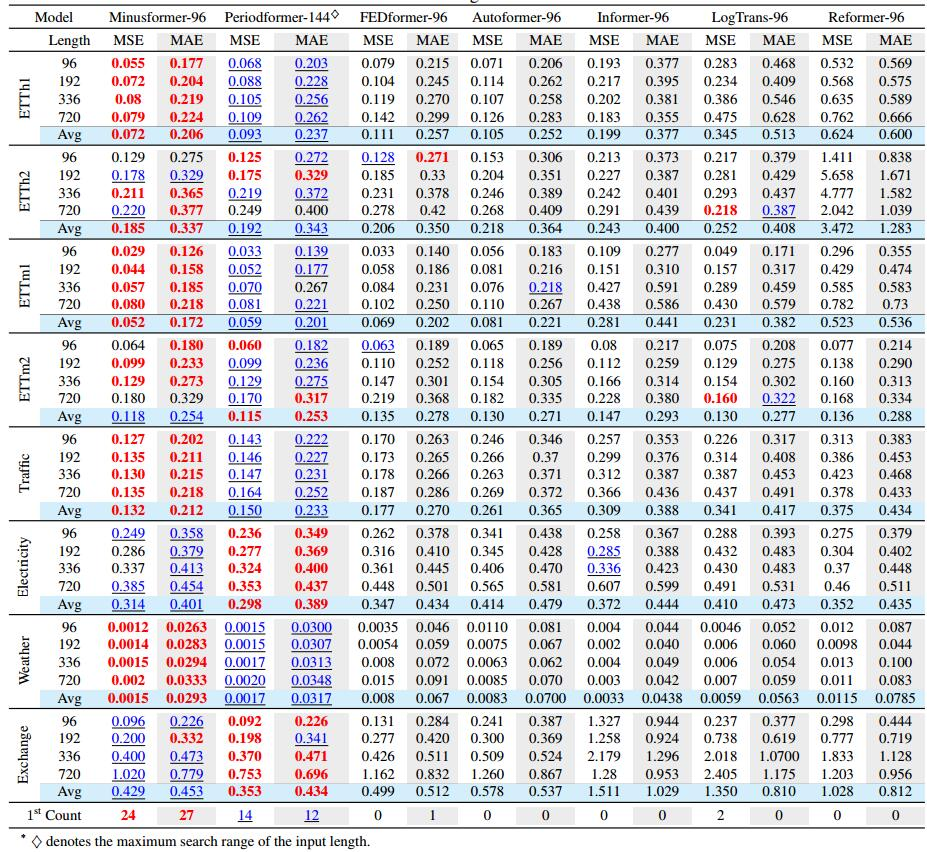

# Minusformer: Improving Time Series Forecasting by Progressively Learning Residuals

## Introduction

It is find that ubiquitous time series (TS) forecasting models are prone to severe overfitting. To cope with this problem, we embrace a de-redundancy approach to progressively reinstate the intrinsic values of TS for future intervals. Specifically, we renovate the vanilla Transformer by reorienting the information aggregation mechanism from addition to subtraction. 
The output of subsequent modules in this branch will subtract the previously learned results, enabling the model to learn the residuals of the supervision signal, layer by layer.
This designing facilitates the learning-driven implicit progressive decomposition of the input and output streams, empowering the model with heightened versatility, interpretability, and resilience against overfitting.
Extensive experiments demonstrate the proposed method outperform existing state-of-the-art methods, yielding an average performance improvement of **11.9%** across various datasets.


 

## Contributions

 - It is find that ubiquitous time series (TS) forecasting models are prone to severe overfitting.
 - We renovate the vanilla Transformer by reorienting the information aggregation mechanism from addition to subtraction. And an auxiliary output branch is incorporated into each block of the original model to construct a highway leading to the ultimate prediction.
 - The proposed Minusformer facilitates the learning-driven implicit progressive decomposition of the input and output streams, empowering the model with heightened versatility, interpretability, and resilience against overfitting.
 - Minusformer outperform existing state-of-the-art methods, yielding an average performance improvement of **11.9%** across various datasets.


## Training and Testing Minusformer
Clone the code repository
```git
git clone git@github.com:Anoise/Minusformer.git
```

### Training on Time Series Dataset
Go to the directory "Minusformer/", we'll find that the bash scripts are all in the 'scripts' folder, like this:

```
scripts/
├── Electricity
│   ├── Minus-Autoformer_96M.sh
│   ├── Minus-Flowformer_96M.sh
│   ├── Minusformer_336M.sh
│   ├── Minusformer_96M.sh
│   ├── Minusformer_96S.sh
│   ├── Minus-Informer_96M.sh
│   └── Minus-Periodformer_96M.sh
├── ETTh1
│   ├── Minusformer_ETTh1_336M.sh
│   ├── Minusformer_ETTh1_96M.sh
│   └── Minusformer_ETTh1_96S.sh
├── ETTh2
│   ├── Minusformer_ETTh2_336M.sh
│   ├── Minusformer_ETTh2_96M.sh
│   └── Minusformer_ETTh2_96S.sh
├── ETTm1
│   ├── Minusformer_ETTm1_336M.sh
│   ├── Minusformer_ETTm1_96M.sh
│   └── Minusformer_ETTm1_96S.sh
├── ETTm2
│   ├── Minusformer_ETTm2_336M.sh
│   ├── Minusformer_ETTm2_96M.sh
│   └── Minusformer_ETTm2_96S.sh
├── Exchange
│   └── Minusformer_96s.sh
├── Pems
│   ├── Minusformer_336M.sh
│   └── Minusformer_96M.sh
├── SolarEnergy
│   ├── Minus-Autoformer_96M.sh
│   ├── Minus-Flowformer_96M.sh
│   ├── Minusformer_336M.sh
│   ├── Minusformer_96M.sh
│   ├── Minus-Informer_96M.sh
│   └── Minus-Periodformer_96M.sh
├── Traffic
│   ├── Minus-Autoformer_96M.sh
│   ├── Minus-Flowformer_96M.sh
│   ├── Minusformer_336M.sh
│   ├── Minusformer_96M.sh
│   ├── Minusformer_96S.sh
│   ├── Minus-Informer_96M.sh
│   └── Minus-Periodformer_96M.sh
└── Weather
    ├── Minus-Autoformer_96M.sh
    ├── Minus-Flowformer_96M.sh
    ├── Minusformer_336M.sh
    ├── Minusformer_96M.sh
    ├── Minusformer_96S.sh
    ├── Minus-Informer_96M.sh
    └── Minus-Periodformer_96M.sh    
```

Then, you can run the bash script like this:
```shell
    bash scripts/Electricity/Minusformer-96M.sh
```


Note that:
- Model was trained with Python 3.7 with CUDA 11.2.
- Model should work as expected with pytorch >= 1.12 support was recently included.

## Performace on Multivariate Time Series


## Performace on Univariate Time Series



## Ablation Studies of Minusformer with Various Attention

All results are averaged across all prediction lengths. The tick labels of the X-axis are the abbreviation of Attention types.


## Good Interpretability

Visualization depicting the output of each block in Minusformer. The experiment was implemented on the Traffic dataset using the setting of Input-96-Predict-96. The utilized models have the same hyperparameter settings and similar performance.


## Go Deeper


Given the Minusformer’s robustness against overfitting, it can be designed with considerable depth. Even with the Minusformer blocks deepened to 8
or 16, it continues to exhibit excellent performance.

## Citations

Liang, D., Zhang, H., Yuan, D., Zhang, B., & Zhang, M. (2024). Minusformer: Improving Time Series Forecasting by Progressively Learning Residuals. arXiv preprint arXiv:2402.02332.
